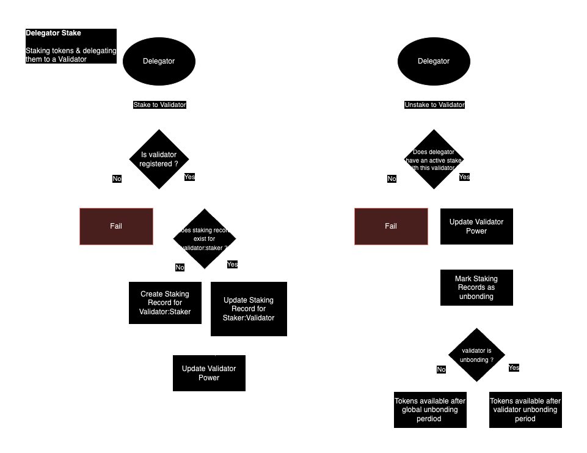
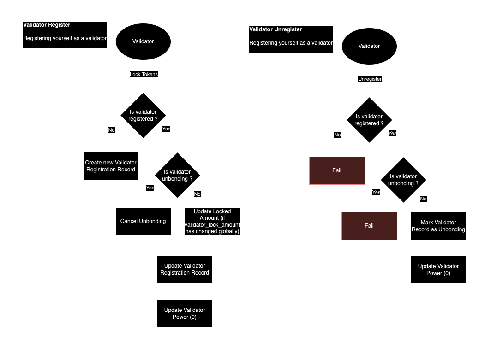

# Governance / Staking

Xian tokens can be used to engage in governance in two ways : 

- Become a validator.
- Delegate Xian tokens to an existing validator.

## Becoming a validator
- Validators provide a vital purpose on the Xian network by creating & validating blocks.
- Set up the proper hardware, following our setup guide (LINK)
- Notify the community on the Forums (LINK) or Telegram about your intention to become a validator, let them know about your core values and principles, asking people to delegate their stake to you.

## Become a delegator
- Delegators add to the decentralisation of the network by allowing any user to stake their tokens & assign the voting power of those tokens to a validator.
- To delegate tokens, use the xian-wallet (LINK)

## Incentives

Both validators & delegators earn rewards in two ways :
- A variable % of their locked tokens back as a reward for participating in network governance.
- Transaction fees from each block are split proportionally between all validators & delegators, once other fees are allocated (black_hole, foundation)
- Validators may charge a commission %, which will be subtracted from the transaction fees before being split with delegators

## Variable reward
The reward % on tokens staked varies as the network attempts to incentivise an optimal % of circulating tokens to be locked in governance.

## Validator Votes

The following values can be changed via governance votes :

* `staked_target` - the optimal # of tokens staked by delegators / validators
* `reward_target` - the reward per annum awarded to staked tokens when the amount staked is at `staked_target`
* `staking_epoch_length` - how often a new staking epoch is created.
* `reward_min` - the minimum reward that can be awarded to stakers, as the `total_staked` exceeds `staked_target`
* `reward_max` - the maximum reward that can be awarded to stakers, as `total_staked` falls below `staked_target`
* `reward_steepness` - the rate of change of the reward amount.
* `validators_max` - the maximum amount of validators involved in producing blocks.
* `validator_lock_amt` - the amount a validator must lock to become a validator.

## Staking Epochs

* Staking epochs exist as a snapshot of all validators & delegators stakes in a given time period.
* a snapshot of validator power & individual validator commission % (which can be changed by a validator)
* At the end of the `staking-epoch`, all rewards accumulated are available to be claimed by the owners of tokens staked at the beginning of that epoch.
    * A record is added to the `staking-epoch` detailing how many tokens are to be minted & how much many fees were accumulated. 
* At the beginning of a new `staking-epoch`, a record is created of the global amt staked & the owners of those tokens.
* New tokens locked by validators / delegators will not be recognised & eligble to participate in governance & receive rewards until the beginning of the following `staking-epoch`

```python
# StakingEpoch
# Values in the StakingEpoch are snapshots of relevant state from the parent & other contracts (where the states live & their format is TBA)
{
    staked_active: 3000000 # float // the amount staked in the active validator set at the beginning of the epoch
    total_staked: 40000000 # float // the smount staked in the entire validator set (inactive + active)
    staked_target: 6000000 # float // the amount of xian tokens in circulation at beginning of the epoch
    start: # time
    end: # time // start + staking_epoch_length
    reward_target: 0.1 # float // 10%
    reward_min: 0.05 # float // 5%
    reward_max: 0.2 # float // 20%
    reward_steepness: 0.01 # float
    validators_max: 30 # int
    validators : { # the validators in the active validator set & their staked
        <validator_account>: {
            v_power: 10000 # the power of the validator locked tokens
            d_power: 800000 # the power of the tokens delegated to this validator
            commission: 0.1 # the commission fee the validator takes on fees.
            unbonding: False # This can be a Date or False
        }
    }
}
```

Issues : 
    - Should Staking Epoch be a Hash or a dict ?

```python
# Combined function to target rewards % : 
import math

def sigmoid(x, target, k=1):
    return 1 / (1 + math.exp(-k * (x - target)))

def inverse_sigmoid(x, target, k=1):
    return 1 - sigmoid(x, target, k)

def combined_reward(x, target, k=1, reward_min=0.05, reward_max=0.20, reward_target=0.10):
    if x < target:
        sigmoid_value = sigmoid(x, target, k)
        return reward_target + (reward_max - reward_target) * (1 - sigmoid_value)
    elif x == target:
        return reward_target
    else:
        inverse_sigmoid_value = inverse_sigmoid(x, target, k)
        return reward_target - (reward_target - reward_min) * (1 - inverse_sigmoid_value)

# Example usage
staked_target = 1000
reward_steepness = 0.01  # Adjust this value to control the reward_steepness
reward_min = 0.05
reward_max = 0.20
reward_target = 0.10

# Test cases
staked_amounts = [800, 1000, 1200, 1500, 2000]

for amount in staked_amounts:
    reward_percentage = combined_reward(amount, staked_target, reward_steepness, reward_min, reward_max, reward_target)
    print(f"Staked Amount: {amount}, Reward Percentage: {reward_percentage * 100:.2f}%")

"""
### Output
Staked Amount: 800, Reward Percentage: 18.19%
Staked Amount: 1000, Reward Percentage: 10.00%
Staked Amount: 1200, Reward Percentage: 9.88%
Staked Amount: 1500, Reward Percentage: 8.18%
Staked Amount: 2000, Reward Percentage: 5.12%
"""
```

## Staking Tokens

- Aspiring validators must lock tokens to register as a validator.
    - This will immediately allow the validator to join the validator set, provided they have enough staked or tokens delegated to them to join the quorum
    - Rewards will not begin accruing until the next `staking_epoch`

- Delegators can delegate tokens to a validator by locking them and selecting a validator
    - The validator will immediately gain the voting power of those tokens
    - Rewards will not begin accruing until the beginning of the next `staking_epoch`

- Only validators in the active validator set & their delegators can receive rewards.

### Unstaking tokens

- Validators and delegators may choose to unstake their tokens at any point
    - Voting weight from these tokens is immediately removed from the validator
    - Validators who un-stake their tokens are immediately removed from the quorum
    - Un-staked tokens will no longer receive rewards after the end of the current StakingEpoch
    - Both validators and delegators who un-stake their token must wait until the validator `unbonding_period` has passed before regaining access to their tokens
    - All rewards must be calculated and credited to the account before performing this action.





The following values can be changed via governance votes :

* `unbonding_period` - the time a staker must wait after un-staking before regaining access to their tokens
* `validators_max` - the maximum amount of validators in the active validator set

## Staking Contract State

```python
StakingEpochs = Hash() # dict
CurrentEpoch = Hash(default_value=0) # The index tracking the current epoch : int
Delegators = Hash() # Delegations:<validator_account>:<delegator_account> : float
Validators = Hash() # Validators:<validator_account> : dict
"""
    {
        amount: float, 
        unbonding: Date or False, 
        v_power: float, 
        d_power: float,
        commission: float,
        epoch_joined: int # The index of current_epoch + 1
        epoch_collected: int or None # The index of the last epoch which rewards were collected for.
    }
"""
Delegators = Hash() # Delegators:<delegator_account>:<validator_account> 
"""
    {
        amount: float, 
        unbonding: Date or False,
        epoch_joined: int # The index of current_epoch + 1
        epoch_collected: int or None # The index of the last epoch which rewards were collected for.
    }
```

## Receiving Rewards

* Delegators & Validators may make a transaction to receive their rewards up to the last finalised `staking-epoch`.
* Each `staking-epoch` the actor was present for must be iterated over, the rewards due calculated & added to the actor's account.
* `epoch_collected` is updated the the last completed `staking_epoch`

### Issues : 
- How do we make sure that delegators only receive rewards for `staking_epochs` where their validator was active ?
- We must make sure that the correct fee % is allocated to validators for each period.
- Fees & rewards must only be allocated for epochs where the validator was present in the active validator set.
- The amount of `staking_epochs` iterated over may be in the thousands, we must ensure that contracting can handle this.
- What's the most efficient way to do this ?


### Restaking / Changing Delegations to different validators
    - Do we want to support this ? / How can this work ?

### When claiming the system must understand : 
    - If the validator was present in the `active_validator_set` for each StakingEpoch
    - The validator commission for each StakingEpoch
    - The amount staked by the claimant for each Epoch