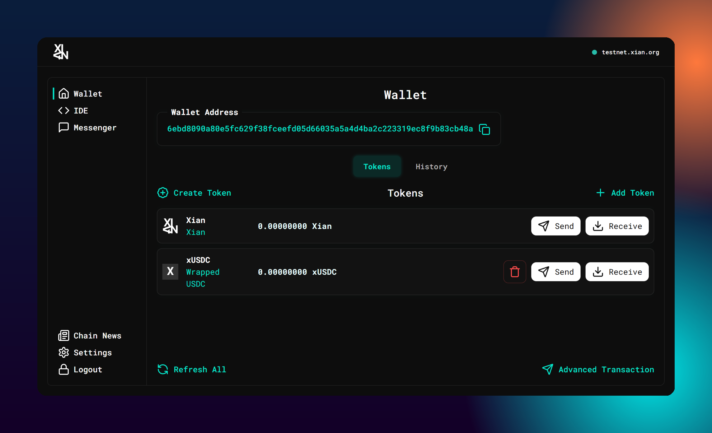
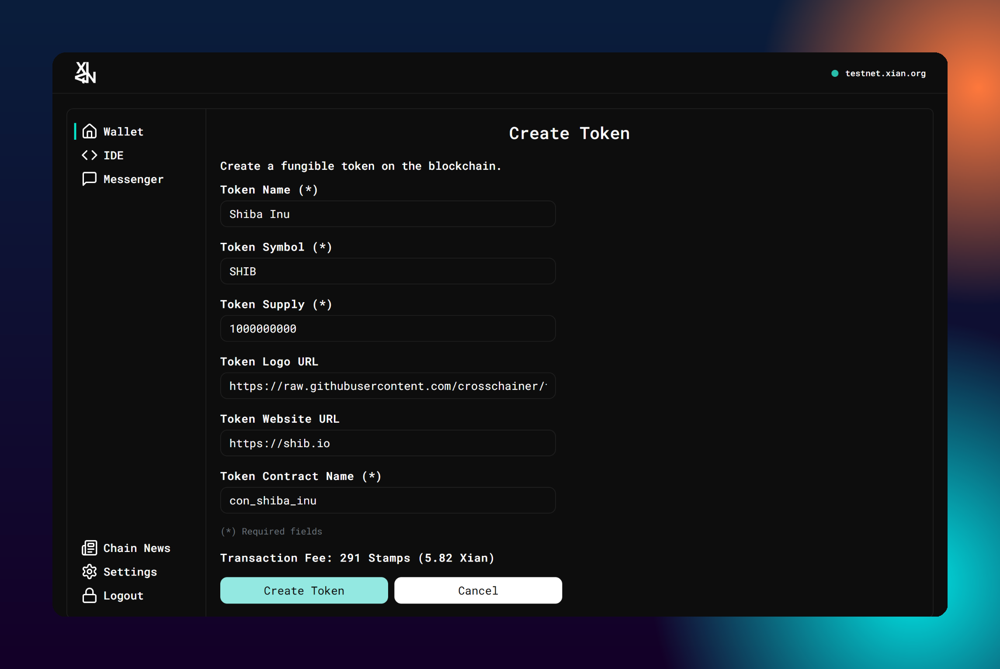
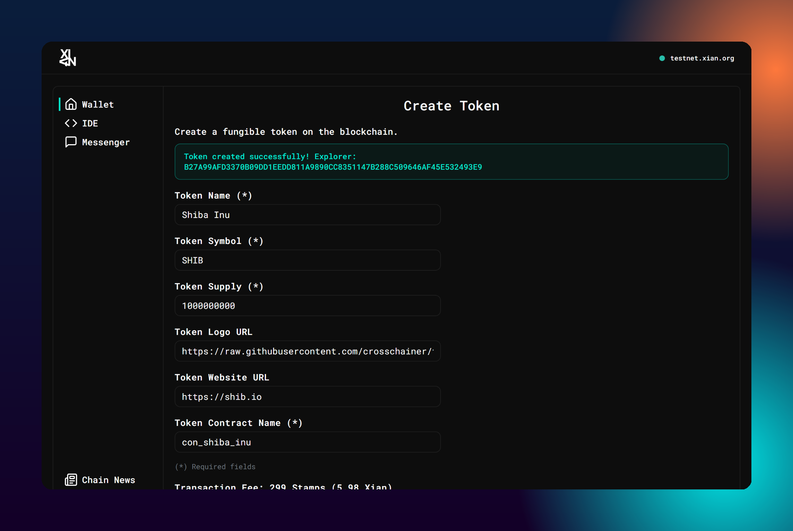
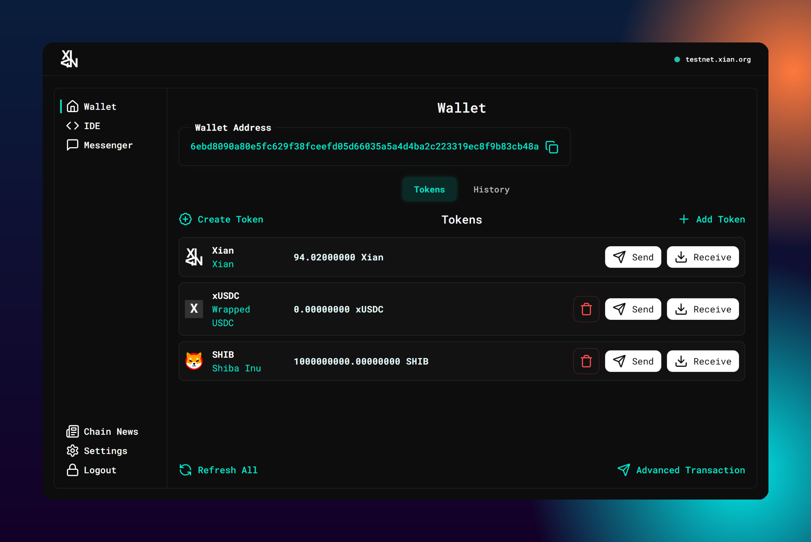
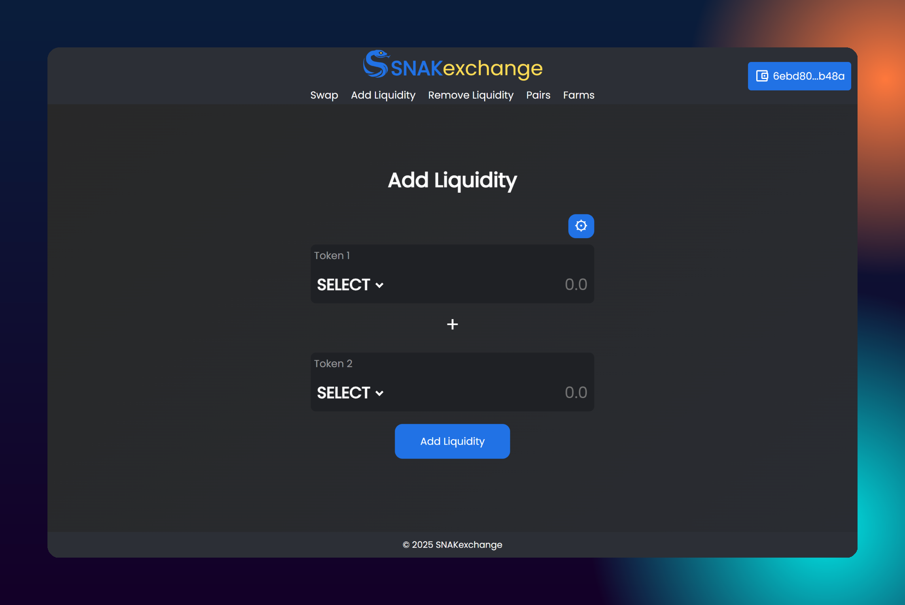
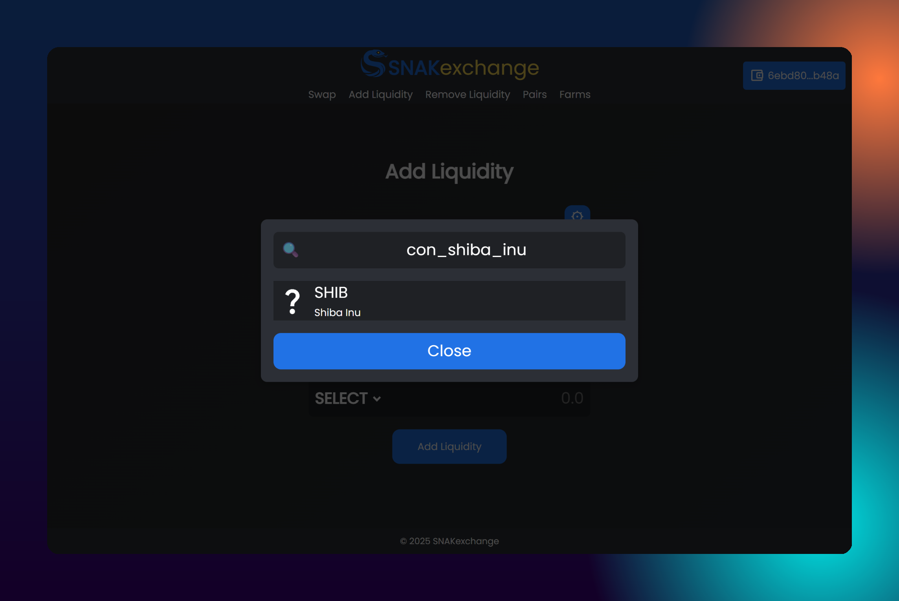
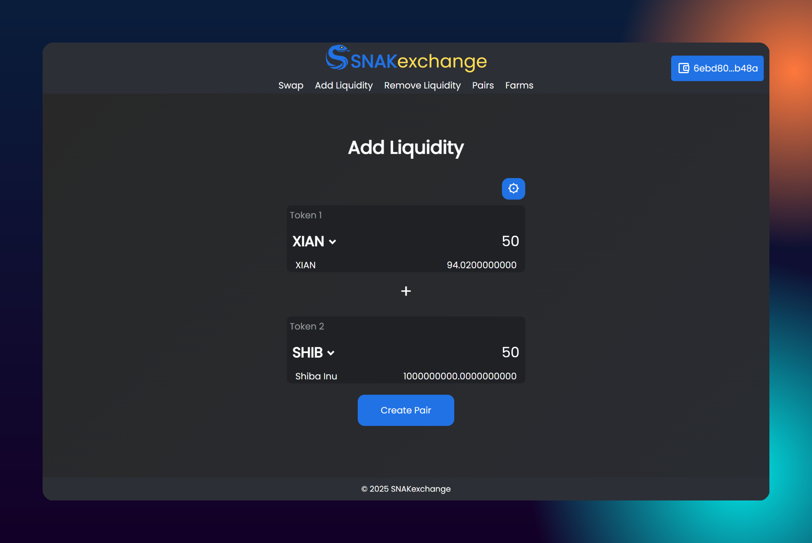
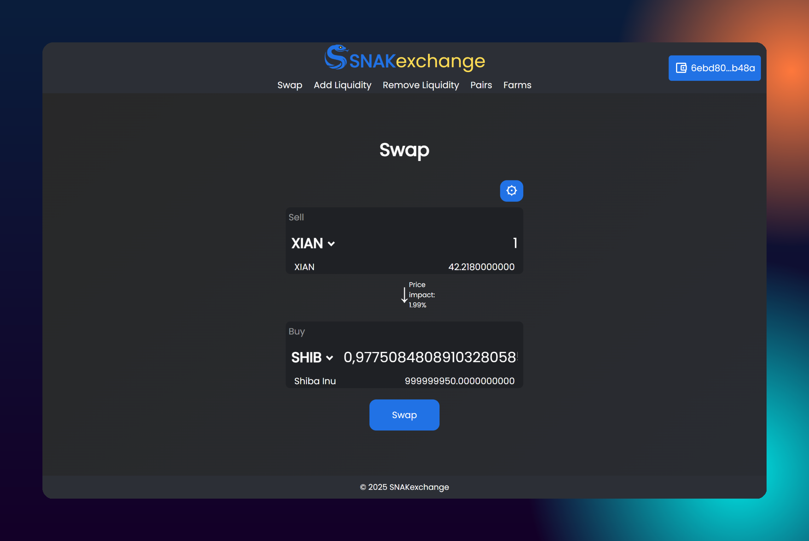

# Creating a Token

Xian is a **developer‑friendly layer‑1 blockchain** designed around Python smart contracts. The network’s native coin ($XIAN) powers transaction fees and governance, and a chrome extension wallet makes it easy for anyone to deploy tokens without writing any code.  This guide walks through each step — from installing the wallet to adding liquidity on SNAKexchange — and highlights the **best practices** recommended in Xian’s documentation.

## 1 Prerequisites

| Requirement | Why you need it |
|---|---|
| Xian Wallet extension | This web‑based wallet lets you interact with Xian dApps and deploy tokens.  Install it from the [Chrome Web Store](https://chromewebstore.google.com/detail/xian-wallet/kcimjjhplbcgkcnanijkolfillgfanlc). |
| XIAN tokens | Creating a token consumes **stamps**, which are paid with $XIAN. Acquire XIAN via [SNAKexchange](https://snakexchange.org), [Dex-Trade](https://dex-trade.com/spot/trading/XIANUSDT?interface=classic), the [Xian bridge](https://bridge.xian.org) (After you bought on Raydium) or [(Testnet) Faucet](https://xian-faucet.poc.workers.dev/). |
| A computer with Chrome | The Xian Wallet extension currently supports Chromium‑based browsers. |

> **Security tips:**  Back up your private key and only install the wallet from official links.

## 2 Install and Set Up the Xian Wallet

1. **Install the extension.**  Go to the Chrome Web Store link provided in the docs and add the **Xian Wallet**.  Once installed, click its icon and create a new wallet.  The wallet UI is simple — it lets you hold and transfer tokens, execute smart‑contract calls and more.
2. **Secure your private key.**  Backup the private key. The wallet cannot recover lost keys.
3. **Fund the wallet.**  You’ll need some XIAN to cover transaction fees. Use one of the acquisition methods listed in the prerequisites section — e.g., trade on SNAKexchange, buy on Dex‑Trade, bridge from Solana or claim from the faucet. Small amounts are sufficient for testnet experimentation.

Once your wallet is funded, you’ll see the default **Xian** and **xUSDC** balances in the token list.  A “Create Token” button appears in the wallet panel — this is your entry point for launching a new token, as shown below:

## 3 Create Your Token

The Xian wallet includes a no‑code **Token Creator** that deploys a fungible token adhering to Xian’s token standards.  Each token is a smart contract on the blockchain; you simply choose the parameters.  Follow these steps:

1. **Click `Create Token`.**  A form appears titled *“Create a fungible token on the blockchain.”*
2. **Fill in token details.**  The following fields are required:

   - **Token Name and Symbol** – human‑readable name and ticker (e.g., *Shiba Inu* and *SHIB*).  Symbols should be short and unique.
   - **Token Supply** – the total amount of tokens minted to your address.  This supply will be available in your wallet immediately after creation.  There is currently no built‑in mint/burn function, so choose a supply you’re comfortable with.
   - **Token Contract Name** – the smart‑contract identifier.  All Xian contracts start with `con_`; the name must be unique (e.g., `con_shiba_inu`).  You will share this contract name with others when listing the token on dApps.

   Optional fields include a **Token Logo URL** (a 1:1 PNG hosted on GitHub or IPFS) and a **Token Website URL**.  These details improve your token’s appearance in wallets and explorers.  An example form is shown below:

3. **Review transaction fee.**  At the bottom of the form, the wallet displays the fee in **stamps** and its $XIAN equivalent.  Every transaction on Xian requires you to supply stamps; unused stamps are refunded, but if your contract runs out of stamps the transaction reverts.  Writing data to state costs 0.025 stamps per byte, and the maximum per transaction is 6 500 stamps.  Ensure your wallet balance can cover the fee.
4. **Create the token.**  When you click **Create Token**, the wallet will prompt you to confirm the transaction.  After confirmation, it broadcasts the smart contract to the blockchain.  A success message appears with a link to the transaction in the block explorer.  The contract name shown here is your token’s address on Xian:

After creation, navigate back to the wallet home.  You’ll see your new token listed alongside your XIAN balance, as shown below.  The supply you minted is now held in your wallet.

### Best Practices for Token Deployment

- **Choose descriptive names and unique symbols.**  Avoid copying names of existing projects to prevent confusion.
- **Use a good logo.**  Upload a 1:1 PNG via GitHub’s raw file link or IPFS.  This helps wallets display your token professionally.
- **Record your contract name.**  Others will need the `con_…` identifier to add the token in their wallets or dApps.
- **Budget for fees.**  Stamps convert dynamically to $XIAN based on governance decisions.  Fees for token creation are usually small (as seen in the screenshot) but they may fluctuate.

## 4 Add Liquidity on SNAKexchange

Creating a token doesn’t automatically make it tradeable.  You need to provide liquidity so that others can swap the token on SNAKexchange (Xian’s native DEX).  Liquidity is provided by depositing equal‑value amounts of two tokens into a liquidity pool.  Here’s how to set up a trading pair for your new token against XIAN:

1. **Navigate to SNAKexchange.**  Go to [snakexchange.org](https://snakexchange.org) and connect your Xian Wallet.  Use the **Add Liquidity** tab.  Initially both token selectors will be empty:

2. **Select Token 1 (XIAN).**  Click the top selector and choose **XIAN** from the list.  This will be the base currency in your pair.
3. **Select Token 2 (your token).**  Click the second selector.  In the search box, paste or type your token’s contract name (`con_yourtoken`).  The DEX should display your token.  Select it:

4. **Set the initial ratio.**  Enter amounts of XIAN and your token to seed the pool.  The first liquidity provider sets the initial price.  Make sure you have enough of both assets in your wallet.  A typical starting ratio might be 1 XIAN to 1 000 tokens, but you can choose any proportion.  An example pair with 50 XIAN and 50 SHIB is shown below:

5. **Create the pair.**  Click **Create Pair** (or **Add Liquidity**) and confirm the transaction in your wallet.  The DEX will deploy a new liquidity pool contract and mint liquidity‑provider (LP) tokens to your wallet.  These LP tokens represent your share of the pool.

After a brief wait, the pair will appear in the **Pairs** section of SNAKexchange.  You and other users can now swap between XIAN and your token.  The **Swap** tab demonstrates how to trade 1 XIAN for the newly created token, showing the amount received and the price impact:

## 5 Summary & Next Steps

By following this guide you have:

- Installed and secured the **Xian Wallet**, which lets you hold and interact with XIAN‑based tokens.
- Acquired $XIAN, the coin used to pay for transaction stamps, governance, staking and more.
- Used the wallet’s no‑code **Token Creator** to deploy a fungible token with custom name, symbol and supply.
- Provided liquidity on **SNAKexchange** so others can trade your token against XIAN.

To grow your token’s community, share the contract name, build a Telegram/Discord presence and encourage others to add liquidity.  Remember that Xian’s fees are paid in stamps and unused stamps are refunded. Always verify contract addresses and URLs before approving transactions.

For more details on smart‑contract development, explore the documentation further and consider deploying custom Python contracts.  Happy building!
